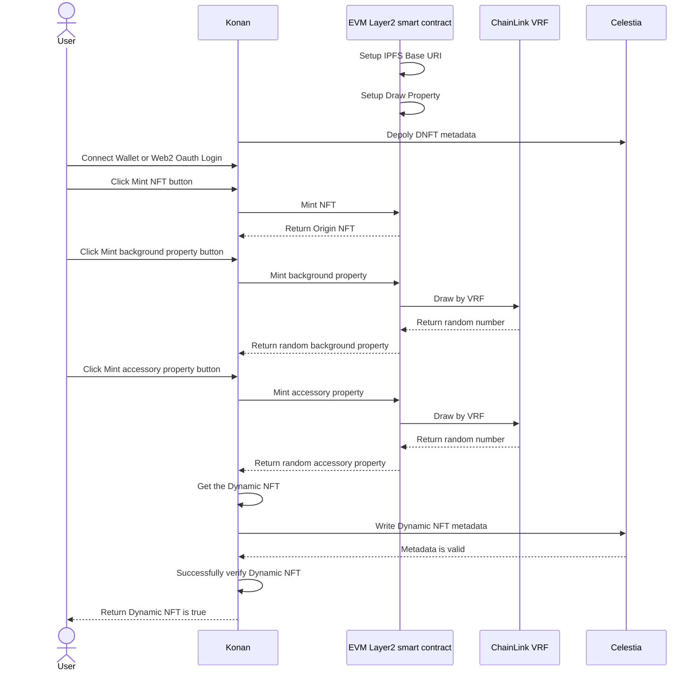

<div align="center">
<h1>Konan</h1>

</img>

[](https://github.com/hollow-leaf/Konan/actions/workflows/ghpage.yaml)

</div>

### Demo Page

- Video： [Konan demo](https://youtu.be/aFThCDy1UNg?si=9SaA8jX0pGBX45nK)
- Konan Contract：
  - Arbitrum Sepolia： [BlackStone](https://sepolia.arbiscan.io/address/0x585a1DDaB9116F483d367bCa6eb64797252051c8)
  - Celestia：celestia1px5kx8h2jzrtynchjht5u2qefl39kec5vagkpd

### Abstract

Konan is an innovative GameFi game that elevates the concept of decentralized dynamic NFTs (dNFTs) to new heights. In this game, players can log in using OAuth or a Web3 wallet to randomly draw a unique NFT. Through a gacha-like mechanism, players gradually unlock equipment or backgrounds for their NFT characters, obtaining NFTs of varying values in the process!

### Introduction

#### Advantages of Celestia
- Lower Transaction Fees: Celestia offers significantly lower transaction fees, making it more cost-effective for users.
- Guaranteed Data Availability: Celestia ensures data availability within a specific timeframe, enhancing the reliability of your data.
- Verifiable on Any Chain: Data stored on Celestia can be verified on any blockchain, ensuring cross-chain compatibility and transparency.
- Transparent and Large-Scale Storage: Celestia allows users to know exactly what content is being stored, providing clarity and trust. Additionally, it supports the storage of relatively large files, accommodating a wider range of data needs.

#### Why Celestia?

- NFT's metadata use Blobstream to depoly NFT's metadata on Layer2
- Verify NFT's metadata by Celestia network
<br/>

### Key Features

- Unique NFT Drawing Mechanism: As soon as players enter the game, they can randomly draw an NFT character. Each character is unique, with different initial attributes and appearances.

- Gacha Unlock System: Each unlock offers the chance to obtain rare equipment or special backgrounds, enhancing the value and abilities of the character. The results are filled with surprises, providing endless fun and anticipation for every player.

- Dynamic NFT Value: With each unlock, the value of the NFT fluctuates, reflecting market changes and player behavior. This makes each NFT dynamically valuable, serving as both a collectible and an investment.

### Technology:

- Celestia Blobstream：Ensures efficient and reliable data streaming, supporting large-scale data storage.
- Succinct：Provides highly compressed data structures, improving storage and retrieval efficiency.
- ChainLink VRF：Utilizes verifiable random functions to generate randomness, ensuring fairness and transparency in the gacha unlock process.
- Arbitrum Network：Offers a fast and low-cost Layer 2 solution, enhancing the game's scalability and user experience.

### Methods

- Use [Celestia](https://celestia.org/what-is-celestia/) to access nft metadata
- Use [ChainkLink](https://chain.link/) VRF to draw nft accessory
- Use [Arbitrum](https://arbitrum.io/) to deploy Smart Contract


### Technical Architecture
Konan Architecture


Konan workflow

### Future Prospects
- Record Draw History: Every draw and result will be meticulously recorded, from the moment players draw equipment to each step of the equipment upgrade process. All data will be securely stored on the Celestia network.
- Verifiable Fairness: Players can review and verify this data at any time, ensuring that the draw probabilities and results have not been tampered with. This leverages Celestia's decentralized nature, enhancing player trust in the game system.

### Building & Installation

> Konan is a monorepo managed using turbo. You can find the source code for each package in the apps/web and package/contract directory.

- apps/web is the Frontend web for Konan. It is built using [Next.js](https://nextjs.org/).
- package/contract is the smart contract for Konan. It is built using [Solidity](https://soliditylang.org/).

## Setting project
### Run Project
```
git clone https://github.com/hollow-leaf/Konan/tree/main
```
```
pnpm i
```
```
pnpm dev
```

### Contributors

- System Architect: [Solo Lin](https://github.com/LinXJ1204)
- Frontend engineer: [Jake Kuo](https://github.com/crypto0627)
- Smart Contract developer: [Albert Cheng](https://github.com/cheng-chun-yuan)
- Designer: [Sophia Liang](https://github.com/Showyuan)
