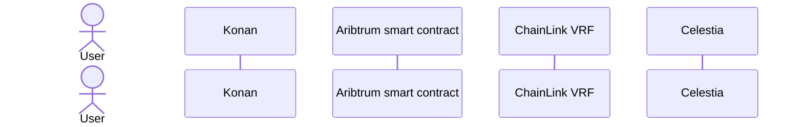

<div align="center">
<h1>Konan</h1>

</img>

[](https://github.com/hollow-leaf/Konan/actions/workflows/ghpage.yml)

</div>

### Demo Page

- Video： [Konan demo](https://youtu.be/aFThCDy1UNg?si=9SaA8jX0pGBX45nK)
- Konan Contract：
  - Arbitrum Sepolia： [BlackStone](https://sepolia.arbiscan.io/address/0x585a1DDaB9116F483d367bCa6eb64797252051c8)
  - ChainLink VRF：
  - Celestia：

### Abstract

Konan is at the forefront of the digital revolution, providing developers with a groundbreaking platform to craft their unique Dynamic Non-Fungible Tokens (DNFTs). Our mission is to democratize the creation and validation of NFT metadata, empowering developers to unleash their creativity and revolutionize the digital asset landscape.

### Introduction

With Konan, developers can tap into a world of endless possibilities by creating DNFTs tailored to their specific needs and visions. Whether it's artwork, collectibles, virtual real estate, or any other digital asset, Konan provides the tools and infrastructure to bring your ideas to life in the form of DNFTs.

Celestia seamlessly integrates with our DNFT platform, allowing developers to effortlessly validate the metadata of their NFTs. By leveraging Celestia's advanced verification mechanisms, developers can ensure the authenticity and integrity of their DNFTs, providing peace of mind to both creators and collectors alike.

Konan's integration with ChainLink streamlines the DNFT generation process, allowing developers to effortlessly incorporate external data into their digital assets.Konan ensures that DNFTs reflect the latest and most relevant information, enhancing their value and utility.

<br/>

### Key Features

- Streamlined DNFT Creation: Konan's intuitive interface and seamless ChainLink integration make DNFT creation effortless, allowing developers to focus on unleashing their creativity without worrying about technical complexities.

- Enhanced Authenticity: By incorporating real-time data feeds, Celestia ensures the authenticity and uniqueness of DNFTs, providing both creators and collectors with confidence in the integrity of their digital assets.

- User-Friendly Interface: Celestia's intuitive platform ensures that DNFT creation is accessible to all users, regardless of technical expertise.


### Our solution:

- Chainlink VRF (Verifiable Random Function)：Generate Dynamic NFT
- Celestia Data Avalibility：Verify ERC-721A token metadata avalibility using Celestia
- Data Security：Ensures transparency and security with Celestia blockchain technology
- UI/UX friendly：Easy integration with a simple interface for users to mint NFT

### Methods

- Use [Celestia](https://celestia.org/what-is-celestia/) to access nft metadata and verify MetaData URI
- Use [ChainkLink](https://chain.link/) VRF to draw nft accessory
- Use [Arbitrum](https://arbitrum.io/) to deploy Smart Contract
- Use [Solidity](https://soliditylang.org/) to develop smart contract
- Use [IPFS](https://ipfs.tech/) to access nft photo and metadata
- Use [Next.js](https://nextjs.org/) to build frontend web
- Use [Cloudflare_serverless](https://developers.cloudflare.com/pages/framework-guides/deploy-a-hono-site/) to build serverless
- Use [Golang](https://go.dev/) to develop backend server

### Technical Architecture
Konan Architecture


Konan workflow


### Building & Installation

> Konan is a monorepo managed using turbo. You can find the source code for each package in the apps/web and package/contract directory.

- apps/web is the Frontend web for Konan. It is built using [Next.js](https://nextjs.org/).
- package/contract is the smart contract for Konan. It is built using [Solidity](https://soliditylang.org/).

## Setting project
### Run Project
```
git clone https://github.com/hollow-leaf/Konan/tree/main
```
```
pnpm i
```
```
pnpm dev
```

### Contributors

- System Architect: [Solo Lin](https://github.com/LinXJ1204)
- Frontend engineer: [Jake Kuo](https://github.com/crypto0627)
- Smart Contract developer: [Albert Cheng](https://github.com/cheng-chun-yuan)
- Designer: [Sophia Liang](https://github.com/Showyuan)
